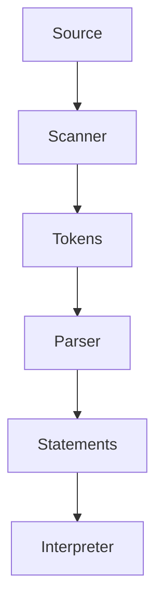

This is an interpreter project for the language Lox from [craftinginterpreters](craftinginterpreters.com)
built in Golang, hence the name Golox. To run this project, you can run the executables located in the `bin` directory, or build the project using `go build`. Run a file by passing it as an argument to the program : 

```
golox lex.golox
```

The interpreter is currently able to evaluate expressions and statements. It supports :
- Variables and expressions
- Blocks and scopes
- Conditionals
- For loop and while loop
- Functions and returns


The goal is to make a working interpreter. Currently, the interpreter consists of :

- Scanner
- Parser
- Interpreter



Testing of the interpreter is still in process.